# Credit risk prediction using gradient boositng

This project delves into the comprehensive analysis of credit risk data to accurately predict the likelihood of loan defaults. By leveraging the power of gradient boosting algorithms, we aim to model complex relationships within the data, ensuring robust and reliable predictions. Our primary objective is to optimize the model's accuracy, thereby enhancing risk assessment processes and enabling financial institutions to make informed lending decisions with greater confidence.

## Data Analysis
The credit risk data has 1000 rows with 10 columns/features.
The first 5 tuples look like this.

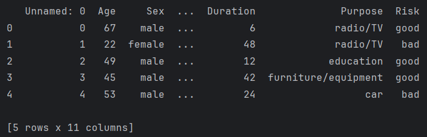

Further using the describe() and info() method we get this.

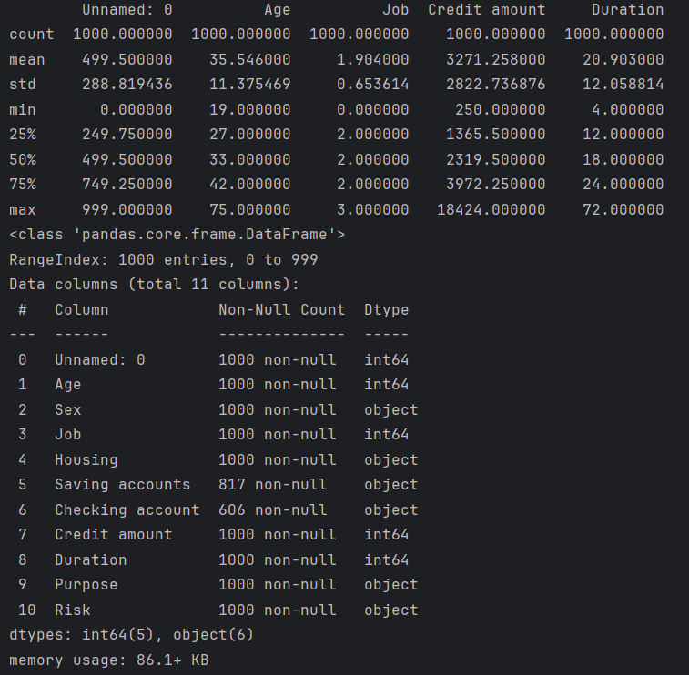

Further we can print out the list of categorical and numerical columns. Print out the number of missing values in each columns.
Also printing out the categories of all the categorical columns.

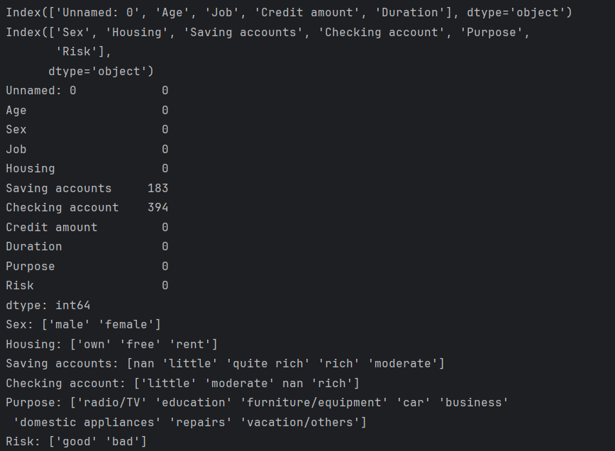

Now to deal with the NULL values. We first saw that its a categorical data so filling the nulls with maximum frequency in a particular column is fine to do. In other words getting the mode of the column containing NAN and filling nulls with the mode value.

After doing this we get this.

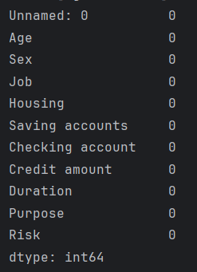

## Visualisation of the data
1. First we will see the count of each categories in the categorical columns.

2. Then we get the distribution of age.

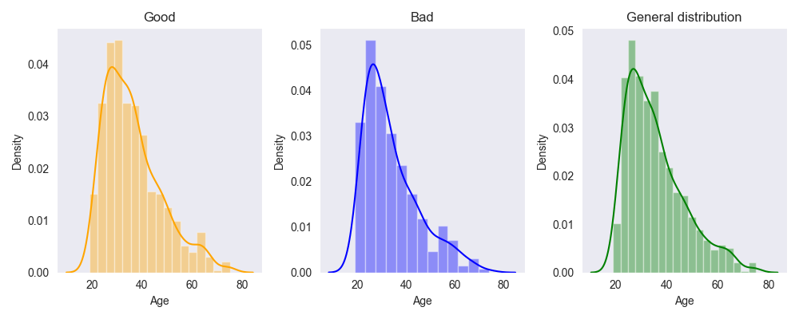

3. We will add age categorical column i.e. for 18-25 -> young, 25-35 -> adult, etc and then we create a box plot of this column with the credit amount.

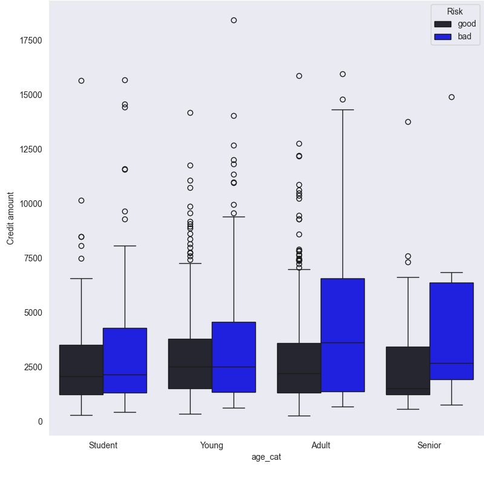

Here we can see some outliers and the median line of each category.

4. Next we will look into the housing attribute.

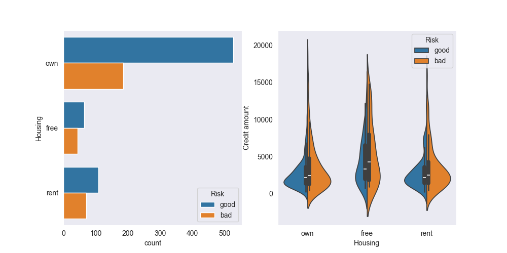

5. The gender/Sex attribute.

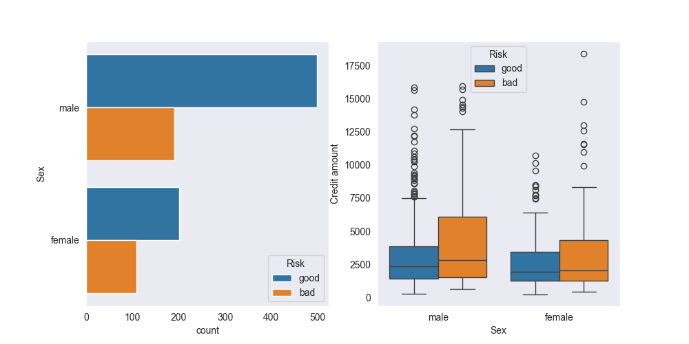

6. The job attribute.

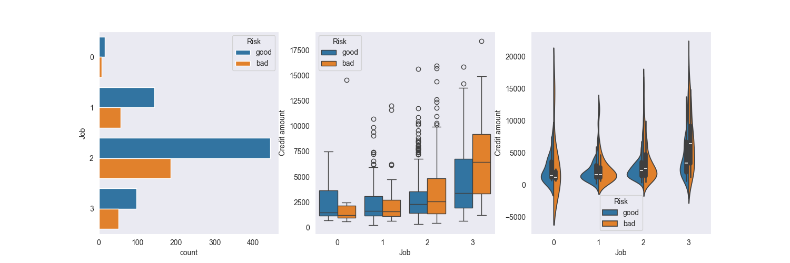

7. Now we will see the distribution of credit amount.

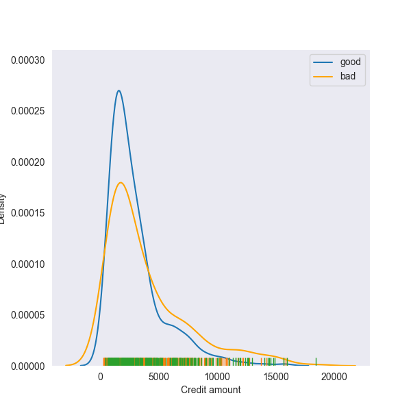

8. Saving account attribute.

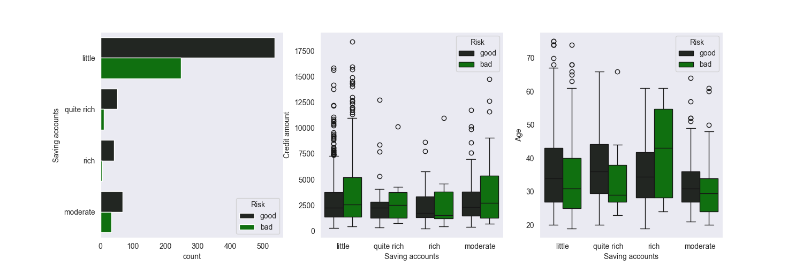

9. Purpose attribute.

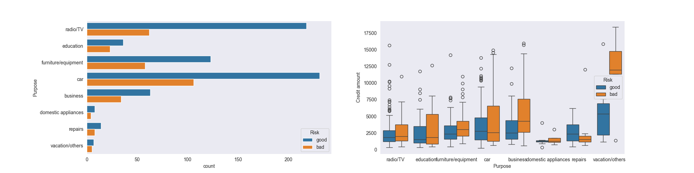

10. Duration attribute.

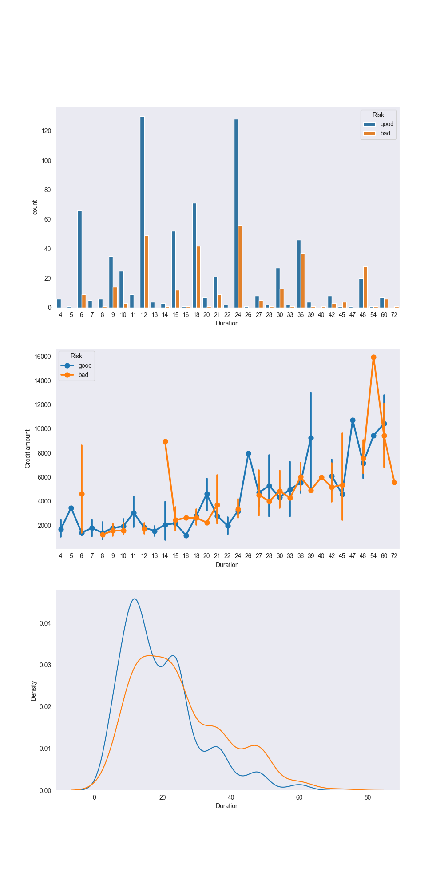

11. Checking account attribute.

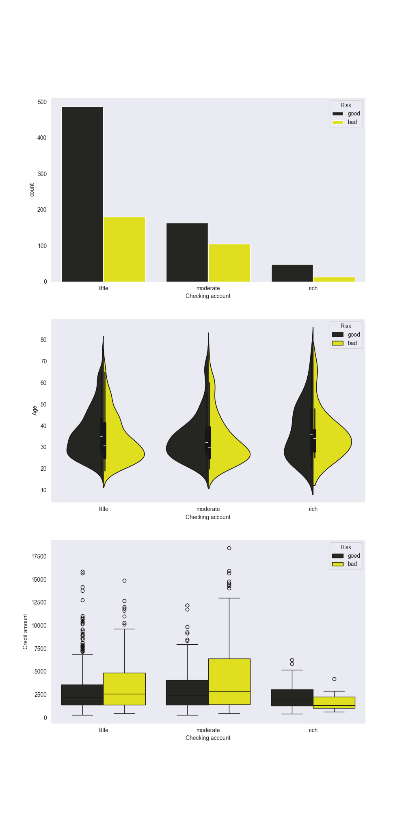

## One hot encoding

One-Hot Encoding is a method used in machine learning and data preprocessing to convert categorical data into a binary format that can be easily processed by algorithms.
To do this we import a file named as oneHotEncoding.py where we defined our function to convert categories in binary format.
Then we pass our data to this function and the resultant new columns are this.

['Sex_female', 'Sex_male', 'Housing_free', 'Housing_own', 'Housing_rent', 'Saving accounts_little', 'Saving accounts_moderate', 'Saving accounts_quite rich', 'Saving accounts_rich', 'Checking account_little', 'Checking account_moderate', 'Checking account_rich', 'Purpose_business', 'Purpose_car', 'Purpose_domestic appliances', 'Purpose_education', 'Purpose_furniture/equipment', 'Purpose_radio/TV', 'Purpose_repairs', 'Purpose_vacation/others', 'Risk_bad', 'Risk_good', 'age_cat_Student', 'age_cat_Young', 'age_cat_Adult', 'age_cat_Senior']

## HeatMap

Now we will create a heatmap which correlates each column with other columns.

The heatmap looks like this.

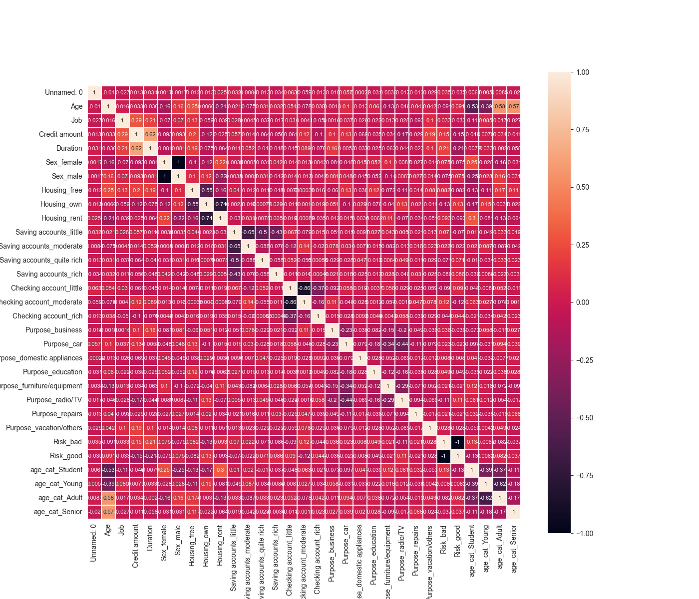

## Training the Gradient boost model